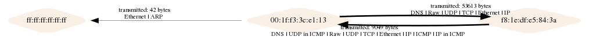
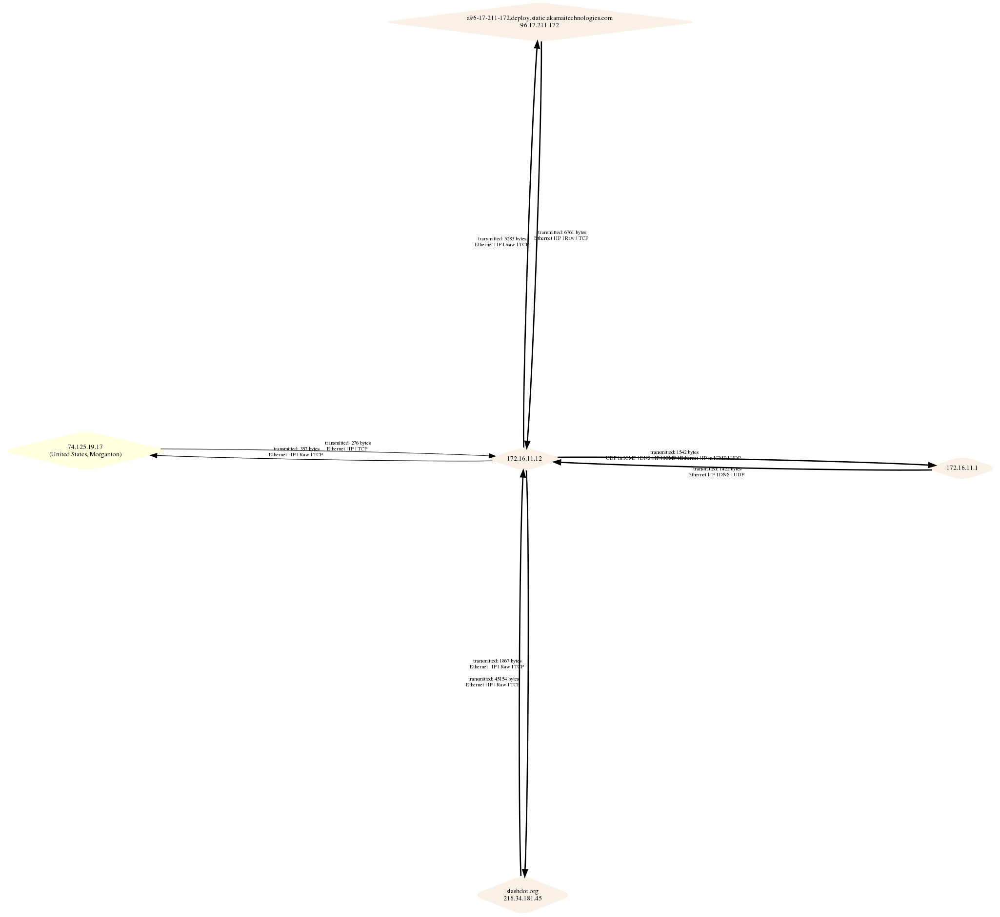
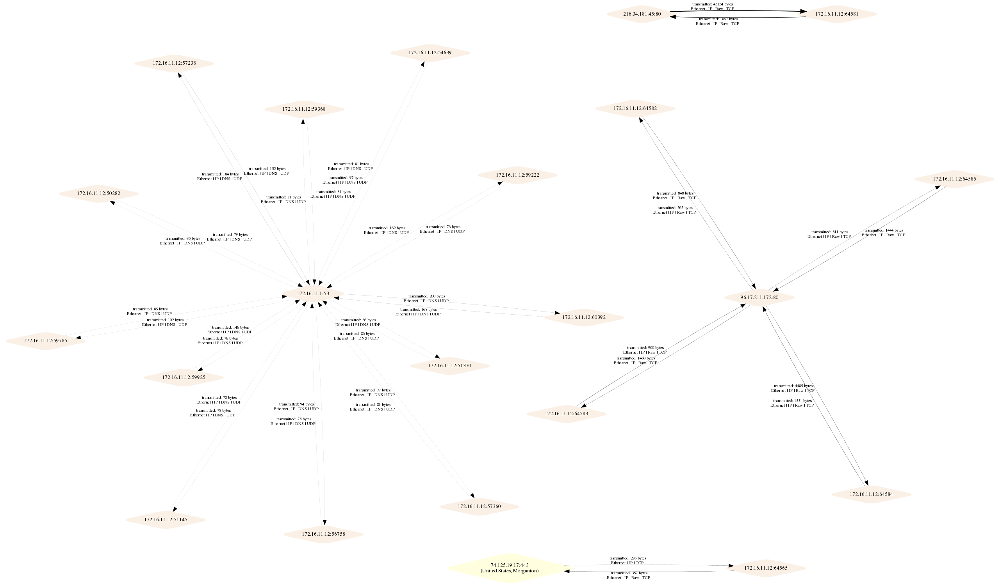

# PcapViz
PcapViz draws networks as device topologies and as information flows using the packet information in pcap files captured from a network
device using tcpcap or other capture software. It filters and optionally displays the captured packets at any one of 3 "layers". These are:

 - device level traffic topology, 
 - ip communication and 
 - tcp/udp communication 

Each yields a distinct network graph from the same set of network packets. This separation makies it much easier to see the data flows at each level rather than mixing them up 
as many other visualisation packages do. It should be possible to determine key topological nodes or to spot patterns of data exfiltration attempts more easily.


## Features
- Network topology graphs - 2 = device; conversation information flow graphs: 3 = ip, 4 = tcp/udp
- Communication graph node labels show country information and connection stats
- Lists the most frequently contacted and frequently sending machines
- Node labels include the host domain name if available from a reverse DNS lookup. 
- command line choice of Graphviz graph layout engine such as dot or sfdp.


## Usage

```
usage: main.py [-h] [-i [PCAPS [PCAPS ...]]] [-o OUT] [-g GRAPHVIZ] [--layer2]
               [--layer3] [--layer4] [-fi] [-fo] [-G GEOPATH] [-l GEOLANG]
               [-E LAYOUTENGINE] [-s SHAPE]

pcap topology and message mapper

optional arguments:
  -h, --help            show this help message and exit
  -i [PCAPS [PCAPS ...]], --pcaps [PCAPS [PCAPS ...]]
                        space delimited list of capture files to be analyzed
  -o OUT, --out OUT     topology will be stored in the specified file
  -g GRAPHVIZ, --graphviz GRAPHVIZ
                        graph will be exported to the specified file (dot
                        format)
  --layer2              device topology network graph
  --layer3              ip message graph. Default
  --layer4              tcp/udp message graph
  -fi, --frequent-in    print frequently contacted nodes to stdout
  -fo, --frequent-out   print frequent source nodes to stdout
  -G GEOPATH, --geopath GEOPATH
                        path to maxmind geodb data
  -l GEOLANG, --geolang GEOLANG
                        Language to use for geoIP names
  -E LAYOUTENGINE, --layoutengine LAYOUTENGINE
                        Graph layout method - dot, sfdp etc.
  -s SHAPE, --shape SHAPE
                        Graphviz node shape - circle, diamond, box etc.
```

## Examples from running tests/core.py on the test.pcap file

**Drawing a communication graph (layer 2), segment**
```
python main.py -i tests/test.pcap -o test2.png --layer2
```



**Layer3 with default sfdp layout**



**Layer4 with default sfdp layout**




Return hosts with largest numbers of incoming packets:

```
python3 main.py -i tests/test.pcap -fi --layer3
4 172.16.11.12
1 74.125.19.17
1 216.34.181.45 slashdot.org
1 172.16.11.1
1 96.17.211.172 a96-17-211-172.deploy.static.akamaitechnologies.com

```

## Installation

**Required:**
 
 * GraphViz
     See system notes below
     
 * Pip package requirements
    The Maxmind Python API and other dependencies will be installed when you run:
	
	```
	pip3 install -r requirements.txt
	```

	so of course, please run that! You are using a python virtual environment aren't you?
	
 
**Not exactly required so Optional** - 2 tests will fail and you'll see no country/city data:

 * [geoIP data](https://dev.maxmind.com/geoip/geoip2/geolite2/):

	
	The Maxmind free GeoIPlite data file is available (at present) using:

	```
	wget http://geolite.maxmind.com/download/geoip/database/GeoLite2-City.tar.gz
	```

    NOTE: As of January 2020, 
    '''wget https://web.archive.org/web/20191227182209/https://geolite.maxmind.com/download/geoip/database/GeoLite2-City.tar.gz'''
    is the easiest place to find a copy of the last release under an OS licence.
    

	For zeek, you need to unpack the file and move GeoIP/GeoLite2-City.mmdb. Zeek uses
	/usr/share/GeoIP/GeoLite2-City.mmdb so that seems a sensible choice and is the default. 
	Use the command line --geopath option to change the path if you use a different location.

	To test the geoip lookup, use an interactive shell:

	```
	>python3
	Type "help", "copyright", "credits" or "license" for more information.
	>>> import maxminddb
	>>> reader = maxminddb.open_database('/usr/share/GeoIP/GeoLite2-City.mmdb')
	>>> reader.get('137.59.252.179')
	{'city': {'geoname_id': 2147714, 'names': {'de': 'Sydney', 'en': 'Sydney', 'es': 'Sídney', 'fr': 'Sydney', 'ja': 'シドニー', 'pt-BR': 'Sydney', 'ru': 'Сидней', 'zh-CN': '悉尼'}},
	'continent': {'code': 'OC', 'geoname_id': 6255151, 
	'names': {'de': 'Ozeanien', 'en': 'Oceania', 'es': 'Oceanía', 'fr': 'Océanie', 'ja': 'オセアニア', 'pt-BR': 'Oceania', 'ru': 'Океания', 'zh-CN': '大洋洲'}}, 
	'country': {'geoname_id': 2077456, 'iso_code': 'AU', 'names': {'de': 'Australien', 'en': 'Australia',
	'es': 'Australia', 'fr': 'Australie', 'ja': 'オーストラリア', 'pt-BR': 'Austrália', 'ru': 'Австралия', 'zh-CN': '澳大利亚'}},
	'location': {'accuracy_radius': 500, 'latitude': -33.8591, 'longitude': 151.2002, 'time_zone': 'Australia/Sydney'}, 'postal': {'code': '2000'}, 
	'registered_country': {'geoname_id': 1861060, 'iso_code': 'JP', 'names': {'de': 'Japan', 'en': 'Japan', 'es': 'Japón', 'fr': 'Japon', 'ja': '日本', 'pt-BR': 'Japão', 'ru': 'Япония', 'zh-CN': '日本'}}, 
	'subdivisions': [{'geoname_id': 2155400, 'iso_code': 'NSW', 'names': {'en': 'New South Wales', 'fr': 'Nouvelle-Galles du Sud', 'pt-BR': 'Nova Gales do Sul', 
	'ru': 'Новый Южный Уэльс'}}]}
	```

### Installation Debian

For Debian-based distros you have to install GraphViz with some additional dependencies:

```
apt-get install python3-dev
apt-get install graphviz libgraphviz-dev pkg-config
```

### Installation OSX

Scapy does not work out-of-the-box on OSX. Follow the platform specific instruction from the [scapy website](http://scapy.readthedocs.io/en/latest/installation.html#platform-specific-instructions)

```
brew install graphviz
brew install --with-python libdnet
brew install https://raw.githubusercontent.com/secdev/scapy/master/.travis/pylibpcap.rb
```

## Testing

Unit tests can be run from the tests directory:
```
python3 core.py
```
The sample images above are the test output graphs.

Note that there are at present 2 warnings about deprecated features in graphviz and for tests to work, you may need to adjust the fake args to point to your copy of the geoIP data file.
Without access to the geoIP data, two of the tests will always fail.

## Acknowledgement
Maxmind ask that this be included - even though we do not distribute the data here it is...

This product includes GeoLite2 data created by MaxMind, available from
<a href="https://www.maxmind.com">https://www.maxmind.com</a>.
