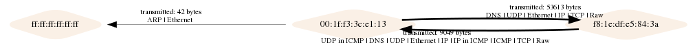

# PcapViz
PcapViz visualizes network topologies and provides graph statistics based on pcap files.
It should be possible to determine key topological nodes or data exfiltration attempts more easily.

## Features
- Draw network topologies (Layer 2) and communication graphs (Layer 3 and 4)
- Network topologies contain country information and connection stats
- Collect statistics such as most frequently contacted machines

## Usage

```
usage: main.py [-h] [-i [PCAPS [PCAPS ...]]] [-o OUT] [-g GRAPHVIZ] [--layer2]
               [--layer3] [--layer4] [-fi] [-fo] [-G GEOPATH] [-l GEOLANG]
               [-E LAYOUTENGINE]

pcap topology drawer

optional arguments:
  -h, --help            show this help message and exit
  -i [PCAPS [PCAPS ...]], --pcaps [PCAPS [PCAPS ...]]
                        capture files to be analyzed
  -o OUT, --out OUT     topology will be stored in the specified file
  -g GRAPHVIZ, --graphviz GRAPHVIZ
                        graph will be exported to the specified file (dot
                        format)
  --layer2              create layer2 topology
  --layer3              create layer3 topology
  --layer4              create layer4 topology
  -fi, --frequent-in    print frequently contacted nodes to stdout
  -fo, --frequent-out   print frequent source nodes to stdout
  -G GEOPATH, --geopath GEOPATH
                        path to maxmind geodb data
  -l GEOLANG, --geolang GEOLANG
                        Language to use for geoIP names
  -E LAYOUTENGINE, --layoutengine LAYOUTENGINE
                        Graph layout method - dot, sfdp etc.

```

## Examples

**Drawing a communication graph (layer 2), segment**
```
python main.py -i tests/test.pcap -o test2.png --layer2
```



**Layer3 with default sfdp layout**


**Layer4 with default sfdp layout**


Return most frequently contacted hosts:
```
python main.py -i smallFlows.pcap --layer3 --frequent-in

115 172.16.255.1
70 192.168.3.131
21 10.0.2.15
2 65.55.15.244
2 224.0.0.252
2 192.168.3.90
2 239.255.255.250
2 255.255.255.255
1 178.144.253.171
1 92.247.222.20
1 72.14.213.103
1 67.170.187.174
...
````

## Installation

Required:
 
 * GraphViz
 
Optional geoIP data:

 * Maxmind data:
```
pip3 install maxminddb
```
to install the maxmind python API into your virtual environment

The Maxmind free GeoIP data file is available at present using:

```
wget http://geolite.maxmind.com/download/geoip/database/GeoLite2-City.tar.gz
```

For zeek, you need to unpack the file and move GeoIP/GeoLite2-City.mmdb to 
/usr/share/GeoIP/GeoLite2-City.mmdb so that's a sensible place for it if you also use zeek. 
Use the command line --geopath option to change the path if you use a different location.

To test the geoip lookup, use an interactive shell:

```
>python3
Type "help", "copyright", "credits" or "license" for more information.
>>> import maxminddb
>>> reader = maxminddb.open_database('/usr/share/GeoIP/GeoLite2-City.mmdb')
>>> reader.get('137.59.252.179')
{'city': {'geoname_id': 2147714, 'names': {'de': 'Sydney', 'en': 'Sydney', 'es': 'Sídney', 'fr': 'Sydney', 'ja': 'シドニー', 'pt-BR': 'Sydney', 'ru': 'Сидней', 'zh-CN': '悉尼'}},
'continent': {'code': 'OC', 'geoname_id': 6255151, 
'names': {'de': 'Ozeanien', 'en': 'Oceania', 'es': 'Oceanía', 'fr': 'Océanie', 'ja': 'オセアニア', 'pt-BR': 'Oceania', 'ru': 'Океания', 'zh-CN': '大洋洲'}}, 
'country': {'geoname_id': 2077456, 'iso_code': 'AU', 'names': {'de': 'Australien', 'en': 'Australia',
'es': 'Australia', 'fr': 'Australie', 'ja': 'オーストラリア', 'pt-BR': 'Austrália', 'ru': 'Австралия', 'zh-CN': '澳大利亚'}},
'location': {'accuracy_radius': 500, 'latitude': -33.8591, 'longitude': 151.2002, 'time_zone': 'Australia/Sydney'}, 'postal': {'code': '2000'}, 
'registered_country': {'geoname_id': 1861060, 'iso_code': 'JP', 'names': {'de': 'Japan', 'en': 'Japan', 'es': 'Japón', 'fr': 'Japon', 'ja': '日本', 'pt-BR': 'Japão', 'ru': 'Япония', 'zh-CN': '日本'}}, 
'subdivisions': [{'geoname_id': 2155400, 'iso_code': 'NSW', 'names': {'en': 'New South Wales', 'fr': 'Nouvelle-Galles du Sud', 'pt-BR': 'Nova Gales do Sul', 
'ru': 'Новый Южный Уэльс'}}]}
```
In case you are using python3 install the following requirements:

```
pip install -r requirements.txt
```

Python2.x requirements can be installed as follows:

```
pip install -r requirements_python2.txt
```

### Installation Debian

For Debian-based distros you have to install GraphViz with some additional dependencies:

```
apt-get install python3-dev
apt-get install graphviz libgraphviz-dev pkg-config
```

### Installation OSX

Scapy does not work out-of-the-box on OSX. Follow the platform specific instruction from the [scapy website](http://scapy.readthedocs.io/en/latest/installation.html#platform-specific-instructions)

```
brew install graphviz
brew install --with-python libdnet
brew install https://raw.githubusercontent.com/secdev/scapy/master/.travis/pylibpcap.rb
```

## Testing

Unit tests can be run from the tests directory:
```
python3 core.py
```
The sample images above are the test output graphs.

Note that there are at present 2 warnings about deprecated features in graphviz and for tests to work, you may need to adjust the fake args to point to your copy of the geoIP data file.
Without access to the geoIP data, two of the tests will always fail.

